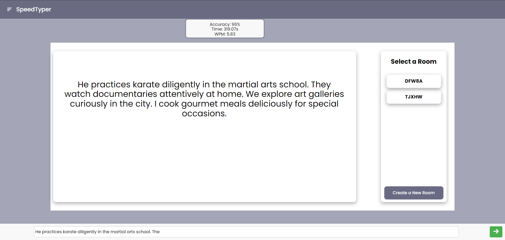

# SpeedTyper - A Typing Speed Test Game

## Introduction

SpeedTyper is a multiplayer typing speed test game that allows users to test their typing speed. The game is designed to be simple and user-friendly, allowing users to easily test their typing speed and improve their typing skills.
The game provides users with a random sentence that they must type as quickly and accurately as possible. Once the user has completed typing the sentence, the game will display their typing speed in words per minute (WPM) and accuracy percentage.


## Features
- Implementation of Jakarta Websockets
- Frontend developed using HTML, CSS and JavaScript.
- Backend powered by Java.
- Deployment via GlassFish 7.0+ server.
- Utilization of Maven for the management of our dependencies.


## Tools Used
- Maven: Dependency management.
- Jakarta EE: Framework for building Java applications.
- GlassFish 7.0+: Application server for deploying the web application.
- HTML, CSS, Javascript: Frontend development.
- Java: Backend development.


## How to Use - Step-By-Step

## Installation and Setup
1. Clone the repository to your local machine
```git
git clone <repository_url>
```
2. Open the project in your preferred IDE(IntelliJ is recommended).
3. Ensure you have Maven installed. If you don't have Maven, you can find the installation at the [Maven Official Website](https://maven.apache.org/download.cgi).
4. Set up GlassFish server on your local machine. The download is [here](https://javaee.github.io/glassfish/download).
5. Build the project using Maven.
```maven
mvn clean install
```
6. Deploy the generated WAR file to GlassFish.
7. Access the web application through the browser using the correct URL.

## Screenshot


## Additional Features
- Calculate the user's typing speed in words per minute (WPM).
- Calculate the user's typing accuracy percentage.
- Display the user's typing speed and accuracy after completing the typing test.
- Allow users to retake the typing test.

## Usage
Once the application is deployed and running, you are able to interact with it through the provided UI.
You can explore the pages and test your typing speed by typing the random sentence provided by the game.

## References
1. In-class code from CSCI-2020U Software Development and Integration @ OntarioTechU

## Contributions
Thank you to our contributors:
- Jonathan McKesey (100863402)
- Julian Cruzet (100870375)
- Ali Shamsi (100874194)
- Dale Malapitan (100823196)